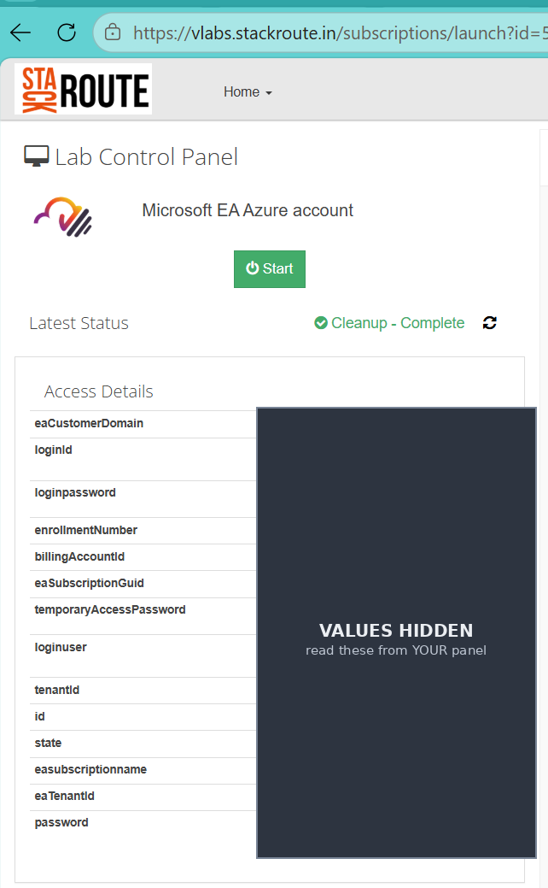
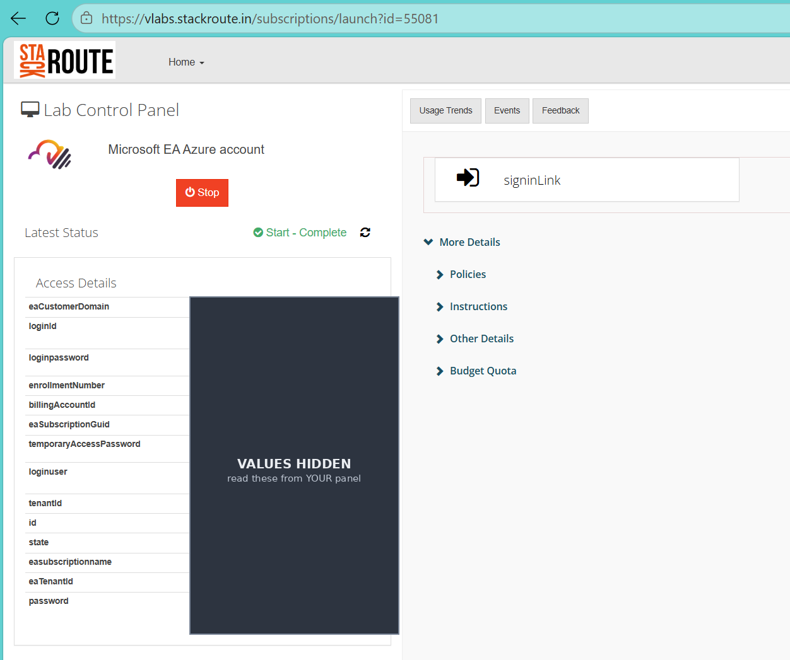

# 00 · Azure CLI Access Check

The **first** step before any Azure lab. It confirms that the Azure lab account provided
through **vlabs** is reachable and usable from the command line, and that you can both
**read** and **write** in the subscription.

Run this once at the start of every lab session (the lab environment is recycled roughly
every 4 hours, so you re-check after each reset).

> Later readiness checks in this repo will also verify local tooling — Azure CLI, Docker,
> Terraform, Python, Node, Helm, etc. This step is **Azure login only**.

---

## Step 1 — Start the lab environment in vlabs

Open your lab in the vlabs portal (StackRoute Lab Control Panel):

```
https://vlabs.stackroute.in/subscriptions/launch?id=<your-lab-id>
```

You'll see the **Microsoft EA Azure account** control panel. If the status shows
*Cleanup – Complete* (or the environment is stopped), click **Start** and wait until the
status becomes **Start – Complete**.





*(The values in the screenshots above are hidden on purpose — you read the real values
from your own panel.)*

---

## Step 2 — Note the two values you need

The **Access Details** table on the panel has several fields. For signing in you need
exactly **two** of them:

| Panel field | Use it as | Notes |
|-------------|-----------|-------|
| **`loginId`** | **Username** | An `...@...onmicrosoft.com` address. (`loginuser` is the same value.) |
| **`loginpassword`** | **Password** | Click the **eye** icon to reveal it, or the **copy** icon to copy it. |

> ⚠️ **Use `loginpassword`.** Do **not** use `temporaryAccessPassword` or the field simply
> labelled `password` — those are different values and will not work for sign-in.

Two more fields are pre-filled as defaults in the scripts; confirm they match your panel,
and override them if yours differ (see [Overriding the defaults](#overriding-the-defaults)):

| Panel field | Meaning |
|-------------|---------|
| `eaSubscriptionGuid` | The Azure **subscription id** the script selects |
| `eaTenantId` | The Azure **tenant id** you sign in to |

---

## Step 3 — Run the access check

The scripts use **device-code sign-in** (a browser step), because the lab tenant enforces
MFA and blocks inline username/password login. No password is ever typed into or stored by
the script.

### Windows (PowerShell)

```powershell
cd "path\to\azure-labs\00-access-check"
./az-access-check.ps1
```

If scripts are blocked by execution policy, run this once in the same window first:

```powershell
Set-ExecutionPolicy -Scope Process -ExecutionPolicy Bypass
```

### macOS / Linux / WSL (bash)

```bash
cd path/to/azure-labs/00-access-check
chmod +x az-access-check.sh    # first time only
./az-access-check.sh
```

### What happens

1. It prompts **`Sign in as [ ... ]`** — press **Enter** to accept the shown login id, or
   type your own `loginId`.
2. It prints a URL and a one-time code, e.g.:

   ```
   To sign in, use a web browser to open the page https://microsoft.com/devicelogin
   and enter the code ABCD-EFGH to authenticate.
   ```

3. Open that URL, enter the code, sign in with your **`loginId` + `loginpassword`**, and
   approve MFA if prompted.
4. The script then checks the subscription, read access, and write access, and prints a
   summary.

> In Windows PowerShell 5.1 the "To sign in…" line may appear in **red** — that is normal,
> not an error.

---

## What a good result looks like

```
==> 4. az login (device code)
  [PASS] Logged in.

==> 5. Subscription
  [PASS] Subscription set to <sub id>.
  [PASS] Active subscription id matches expected.
  [PASS] Tenant id matches expected.

==> 6. Read access
  [PASS] Can list Azure locations (100+ available).
  [PASS] Can list resource groups (currently 0).   # 0 is fine on a fresh lab

==> 7. Write access (create + delete a resource group)
  [PASS] Created resource group swat-readiness-... in centralindia.
  [PASS] Delete of swat-readiness-... requested (running in background).

 Result:  8 passed   0 warnings   0 failed
 Lab account is reachable and usable from the CLI.
```

All checks **PASS** → you're ready for the lab.

---

## Overriding the defaults

Each lab instance has its own login, subscription and tenant. Override with environment
variables (bash) or parameters (PowerShell) to match **your** panel:

| Setting | Env var (bash) | Parameter (PowerShell) |
|---------|----------------|------------------------|
| Login id | `LAB_LOGIN_ID` | `-LoginId` |
| Tenant | `LAB_TENANT_ID` | `-TenantId` |
| Subscription | `LAB_SUBSCRIPTION_ID` | `-SubscriptionId` |
| Region for write test | `LAB_REGION` | `-Region` |
| Skip write test | `DO_WRITE_TEST=false` | `-SkipWriteTest` |

Example (bash):

```bash
LAB_LOGIN_ID='me_...@...onmicrosoft.com' LAB_SUBSCRIPTION_ID='<guid>' ./az-access-check.sh
```

---

## Troubleshooting

| Symptom | Cause / fix |
|---------|-------------|
| `az` not found | Install the Azure CLI: Windows `winget install -e --id Microsoft.AzureCLI`; macOS `brew install azure-cli`. |
| Sign-in code times out | Re-run and complete the browser step within the time limit. |
| Login fails after a reset | The environment was recycled. Click **Start** in vlabs, wait for *Start – Complete*, then re-run. |
| Password rejected | You may be using `temporaryAccessPassword`/`password` — use **`loginpassword`**. If it says the password is expired, sign in once at <https://portal.azure.com> to set a new one. |
| Subscription/tenant "differs from expected" | Your lab's `eaSubscriptionGuid` / `eaTenantId` differ from the script defaults — pass your own with the overrides above. |
| Write test fails to create a resource group | The region may be policy-restricted. Try another region, e.g. `-Region eastus` (PowerShell) or `LAB_REGION=eastus` (bash). |

---

## Files

| File | Platform |
|------|----------|
| `az-access-check.ps1` | Windows (PowerShell 5.1 or 7+) |
| `az-access-check.sh`  | macOS / Linux / WSL (bash) |
| `images/` | Screenshots used in this guide |
