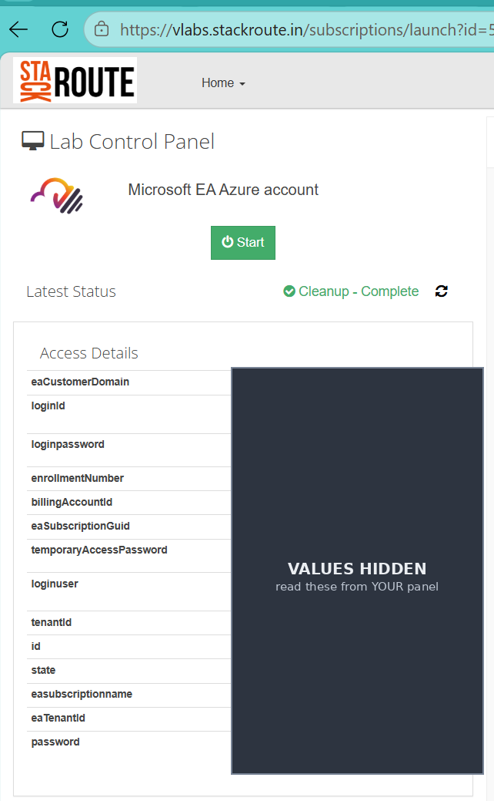
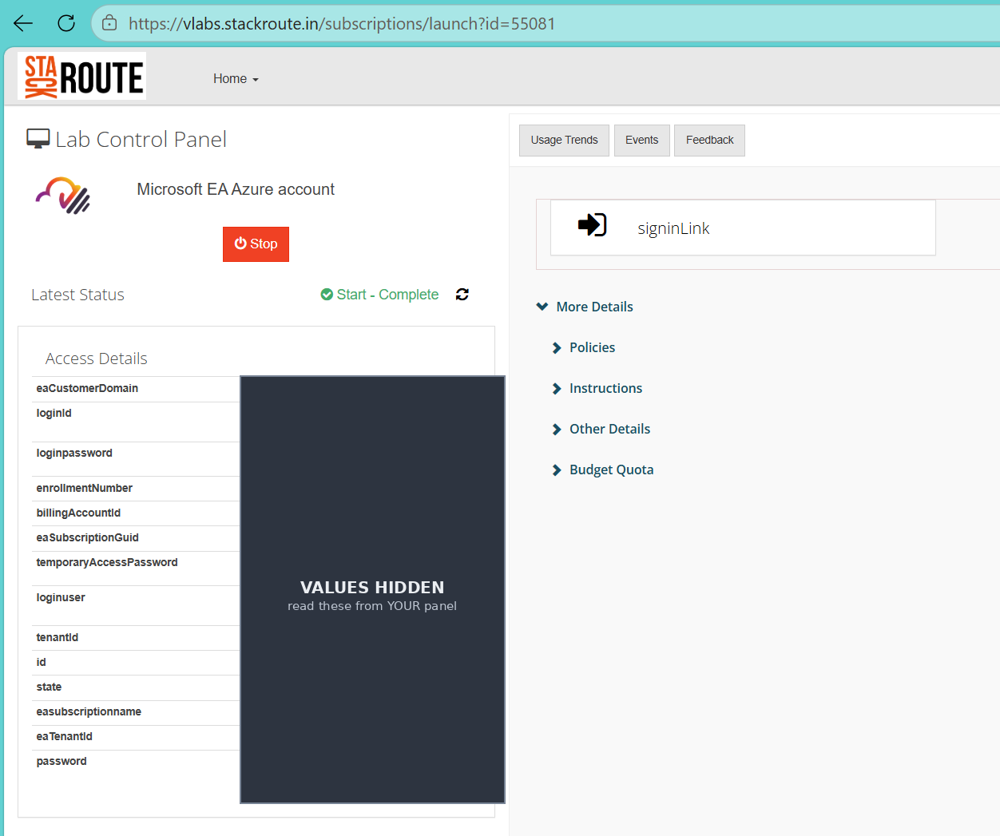

# 00 · Azure CLI Access Check

The **first** step before any Azure lab. It confirms three things:

- The Azure lab account provided through **vlabs** is reachable from the command line.
- Your machine can talk to Azure securely, including behind a company proxy.
- You can both **read** and **write** in the subscription.

Run this once at the start of every lab session. The lab environment is recycled roughly
every 4 hours, so you re-check after each reset.

> `01-prereqs-check` verifies your local tooling: Azure CLI, Docker, Terraform, Python, Node,
> Helm and so on. This step is **Azure sign-in only**.

---

## Step 1 — Start the lab environment in vlabs

Open your lab in the vlabs portal (StackRoute Lab Control Panel):

```
https://vlabs.stackroute.in/subscriptions/launch?id=<your-lab-id>
```

You'll see the **Microsoft EA Azure account** control panel. If the status shows
*Cleanup – Complete*, or the environment is stopped, click **Start**. Wait until the status
becomes **Start – Complete**.





*(The values in the screenshots above are hidden on purpose. Read the real values from your
own panel.)*

---

## Step 2 — Note the two values you need

The **Access Details** table on the panel has several fields. For signing in you need
exactly **two** of them:

| Panel field | Use it as | Notes |
|-------------|-----------|-------|
| **`loginId`** | **Username** | An `...@...onmicrosoft.com` address. (`loginuser` is the same value.) |
| **`loginpassword`** | **Password** | Click the **eye** icon to reveal it, or the **copy** icon to copy it. |

> ⚠️ **Use `loginpassword`.** Do **not** use `temporaryAccessPassword` or the field
> labelled `password`. Those are different values and will not work for sign-in.

You do not need to copy the subscription or tenant id. The script shows the subscription your
login lands in, and you can compare it with `eaSubscriptionGuid` on the panel.

---

## Step 3 — Run the access check

**Windows** — double-click **`az-access-check.cmd`**, or run `.\az-access-check.cmd` in a
terminal in this folder. It works even where your company blocks PowerShell scripts.

**macOS / Linux / WSL:**

```bash
cd path/to/azure-labs/00-access-check
chmod +x az-access-check.sh    # first time only
./az-access-check.sh
```

> Downloaded the repository as a ZIP on Windows? Before extracting, right-click the ZIP →
> *Properties* → tick **Unblock** → *OK*. Keep the whole repository together: this check
> uses the shared `tools` folder.

### What happens

1. It checks that the Azure CLI is installed and whether a newer version exists.
2. It checks that the Azure CLI can connect to Azure securely. If your company network inspects
   HTTPS traffic, it fixes this for you (see [Behind a company proxy](#behind-a-company-proxy)).
3. It asks for **your `loginId`**. Paste it and press **Enter**, or just press Enter to skip.
   The script only uses it to confirm that you signed in with the right account.
4. It prints a URL and a one-time code, for example:

   ```
   To sign in, use a web browser to open the page https://microsoft.com/devicelogin
   and enter the code ABCD-EFGH to authenticate.
   ```

5. Open that URL and enter the code. Sign in with your **`loginId` + `loginpassword`** and
   approve MFA if prompted. If the browser offers your company account, choose **Use another
   account** instead.
6. The script then checks the subscription, read access and write access, and prints a summary.

No password is typed into or stored by the script. Sign-in uses the device code, because the
lab tenant enforces MFA and blocks username/password sign-in from the command line.

> In Windows PowerShell 5.1 the "To sign in…" line may appear in **red**. That is normal, not
> an error.

---

## What a good result looks like

```
==> 3. Network and certificates
  [ OK ] Secure connections to Azure work - no certificate changes needed
  [PASS] The Azure CLI can connect to Azure securely.

==> 4. Sign in
  [PASS] Signed in.

==> 5. Subscription
       Signed-in user : <your loginId>
       Subscription   : <name> (<subscription id>)
  [PASS] Subscription is active.
  [PASS] Signed in as the loginId you entered.

==> 6. Read access
  [PASS] Can list Azure locations (100+ available).
  [PASS] Can list resource groups (currently 0).   # 0 is fine on a fresh lab

==> 7. Write access (create + delete a resource group)
  [PASS] Created resource group swat-readiness-... in eastus.
  [PASS] Delete of swat-readiness-... requested (running in background).

 Result:  9 passed   0 warnings   0 failed
 Lab account is reachable and usable from the CLI.
```

All checks **PASS** → you're ready for the lab. A warning that a newer Azure CLI is available
is fine.

---

## Behind a company proxy

Many company networks inspect HTTPS traffic. The Azure CLI keeps its own list of trusted
certificates and does not trust your company's, so it fails with:

```
[SSL: CERTIFICATE_VERIFY_FAILED] certificate verify failed: self-signed certificate in certificate chain
```

Step 3 of the check fixes this by running [`../tools/fix-company-proxy`](../tools/README.md).
It teaches the Azure CLI (and Git and npm) to trust **exactly what your machine already
trusts**: user-level only, no admin rights, and nothing bypassed. It changes nothing on a network
that does not need it. [`tools/README.md`](../tools/README.md) explains what it changes, why that
is within company policy, and how to undo it.

**Do not** switch certificate checking off, or go around the proxy with a hotspot or personal
VPN, to make the error go away. That breaks company policy.

---

## Optional settings

The script needs no settings. These environment variables exist for unusual cases:

| Variable | Default | Use |
|----------|---------|-----|
| `LAB_REGION` | `eastus` | Region for the write test. The lab allows `eastus`, `eastus2`, `canadacentral`. |
| `LAB_SUBSCRIPTION_ID` | *(the one you land in)* | Pick a subscription if your login sees several. |
| `LAB_TENANT_ID` | *(your home tenant)* | Sign in to a specific tenant. |
| `LAB_SKIP_WRITE_TEST` | *(off)* | Set to `1` to skip the create/delete test. |

Example (bash): `LAB_REGION=eastus2 ./az-access-check.sh`

---

## Troubleshooting

| Symptom | Cause / fix |
|---------|-------------|
| `az` not found | Install the Azure CLI: Windows `winget install -e --id Microsoft.AzureCLI`; macOS `brew install azure-cli`. If your company manages installs, ask IT. |
| Windows warns before running `az-access-check.cmd` | The files came from a downloaded ZIP. Unblock the ZIP before extracting (see Step 3), or choose *Run* on the warning. |
| `CERTIFICATE_VERIFY_FAILED` | A company proxy inspects HTTPS. The check fixes it — see [Behind a company proxy](#behind-a-company-proxy). |
| Sign-in code times out | Re-run and complete the browser step within the time limit. |
| Password rejected | You may be using `temporaryAccessPassword` or `password`. Use **`loginpassword`**. If it says the password has expired, sign in once at <https://portal.azure.com> to set a new one. |
| "Signed in as … not …" / "Lab accounts end in onmicrosoft.com" | The browser signed you in with your company account. Run the check again, and choose **Use another account** on the sign-in page. |
| Sign-in fails or no subscription is visible after a reset | The environment was recycled. Click **Start** in vlabs, wait for *Start – Complete*, then re-run. |
| Write test fails to create a resource group | The region may be policy-restricted. This subscription allows only **`eastus`, `eastus2`, `canadacentral`** — see [`../lab-constraints.md`](../lab-constraints.md). |

---

## Files

| File | Platform |
|------|----------|
| `az-access-check.cmd` | Windows — double-click this |
| `az-access-check.ps1` | Windows (PowerShell 5.1 or 7+); run by the `.cmd` |
| `az-access-check.sh`  | macOS / Linux / WSL (bash) |
| `images/` | Screenshots used in this guide |
