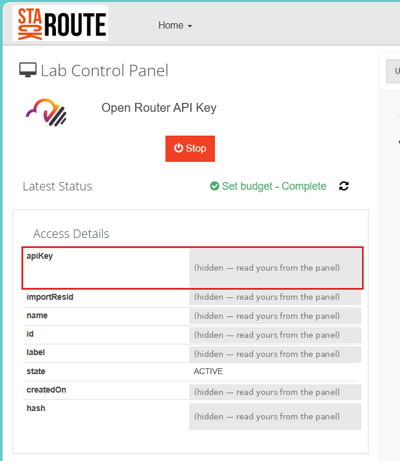

# Set up Claude Code with your lab AI key

If your organisation has not given you a Claude licence, you can still use Claude Code in VS Code
with the AI key from your vlabs lab. Setup takes about ten minutes. The key is paid for by the
programme and has a budget, so the last sections cover how to use it well.

---

## Step 1 — Start the lab and copy your key

1. Sign in to vlabs and open the **Open Router API Key** lab.
2. If the lab is stopped, click **Start** and wait until *Latest Status* shows a green status, such
   as **Set budget – Complete**. **The key only works while the lab is started.**
3. Under **Access Details**, copy the value of **`apiKey`**. It starts with `sk-or-v1-`. Copy the
   whole value; it wraps over more than one line.



*(Values are hidden in the screenshot; read yours from your own panel.)* You need only `apiKey`.
Ignore the other fields.

---

## Step 2 — Install VS Code and Claude Code

1. Install **Visual Studio Code**, version 1.94 or later. If your company manages software
   installs, ask IT.
2. In VS Code, open **Extensions** (`Ctrl+Shift+X`, or `Cmd+Shift+X` on a Mac), search for
   **Claude Code**, and install the extension published by **Anthropic**.
3. **Do not sign in yet.** If the extension asks you to sign in, close that prompt. Step 4 switches
   it off.

---

## Step 3 — Create the settings file

Claude Code reads its settings from one file in your home folder. This tells it to send requests to
OpenRouter with your key, and to use Sonnet by default.

| | Settings file |
|---|---|
| Windows | `%USERPROFILE%\.claude\settings.json` (for example `C:\Users\<you>\.claude\settings.json`) |
| macOS / Linux | `~/.claude/settings.json` |

On Windows, the quickest way to open it is to press `Win+R`, type
`notepad %USERPROFILE%\.claude\settings.json` and press Enter. If Notepad says the file does not
exist, create the `.claude` folder first and try again.

Paste this in, and replace `<your apiKey>` with the key from Step 1, keeping the quotes:

```json
{
  "model": "sonnet",
  "env": {
    "ANTHROPIC_BASE_URL": "https://openrouter.ai/api",
    "ANTHROPIC_AUTH_TOKEN": "<your apiKey>",
    "ANTHROPIC_API_KEY": "",
    "ANTHROPIC_DEFAULT_SONNET_MODEL": "~anthropic/claude-sonnet-latest",
    "ANTHROPIC_DEFAULT_HAIKU_MODEL": "~anthropic/claude-haiku-latest",
    "ANTHROPIC_DEFAULT_OPUS_MODEL": "~anthropic/claude-opus-latest"
  }
}
```

Three details matter:

- **`ANTHROPIC_API_KEY` must stay as an empty string** (`""`). Do not delete the line.
- **If the file already has settings**, keep them and add the `"env"` block alongside them. Mind
  the commas between entries.
- **This file only, never your project.** Do not put the key in a `.claude` folder inside a
  repository you push to GitLab.

---

## Step 4 — Switch off the sign-in prompt, then test

1. In VS Code, open **Settings** (`Ctrl+,`, or `Cmd+,` on a Mac), search for
   **Claude Code: Disable Login Prompt**, and tick it.
2. **Close VS Code completely and open it again**, so Claude Code picks up the settings file.
3. Open your case repository folder (**File → Open Folder**), then open the Claude Code panel (the
   Claude icon in the left bar).
4. Ask something small about one file, for example `@README.md what is this repository for?`

It is working when:

- [ ] Claude answers.
- [ ] The model name under the message box reads `~anthropic/claude-sonnet-latest`.
- [ ] **Account & Usage** shows *Auth method: Anthropic Console*, with no email address. That is
      expected: you are using the lab key, not a personal Claude account.

---

## Use it wisely

Every request is paid from your key's budget, and when the budget runs out the key stops working.
Most of the cost comes from how much Claude has to read, not how long its answer is. A request like
"summarise this whole project" makes it read many files and resend the growing conversation at
every step.

| Habit | Why it helps |
|---|---|
| Point at files with `@file`, not "the whole project" | Claude reads only what you name |
| Type `/clear` when you switch to an unrelated task | Old conversation is no longer resent with every message |
| Stay on **Sonnet** (the default here) | Good enough for the lab work, and much cheaper than Opus |
| Switch to **Haiku** for quick questions (`/model haiku`) | Cheaper again |
| Keep the effort setting at its default | Higher effort means more thinking, which you pay for |
| Ask one clear question at a time | Fewer back-and-forth turns |

The cost shown in **Account & Usage** is only an estimate: it says "costs may be inaccurate" because
Claude Code does not know OpenRouter's model names. The real charge is recorded against your key by
OpenRouter.

---

## Keep the key safe

The key is like a password with money attached: anyone who has it can spend your budget.

- **Never share it**, in chat, email, screenshots or GitLab issues. Each participant has their own.
- **Never commit it.** It belongs only in the settings file in your home folder, not in any
  repository. If it ends up in a commit, tell your facilitator so the key can be replaced.
- **The key is tied to the lab.** If the lab is stopped, Claude Code stops working until you start
  it again in vlabs.

---

## Troubleshooting

| What you see | What to do |
|---|---|
| Claude Code still asks you to sign in | Check Step 4 is ticked, then close and reopen VS Code |
| `401`, "invalid API key" or "authentication failed" | The lab is stopped, or the key was copied incompletely. Start the lab, copy the whole `apiKey` again, reopen VS Code |
| "Insufficient credits" or "budget exceeded" | The key's budget is used up. Tell your facilitator |
| "Model not found" | A model name in the settings file has changed. Check the current name at <https://openrouter.ai/models> and update the matching line |
| `SELF_SIGNED_CERT_IN_CHAIN` or another certificate error | Your company network inspects HTTPS. Run [`../tools/fix-company-proxy.cmd`](../tools/README.md) (Windows) or `../tools/fix-company-proxy.sh` once, then reopen VS Code |
| Requests hang, then time out | Your network blocks `openrouter.ai`. Ask your facilitator; the site may need to be allowed by your IT team |
| Settings seem to be ignored | The file has a JSON mistake, usually a missing comma or quote. Paste it into a JSON checker, or ask your facilitator |

## Undo

Open the settings file from Step 3 and delete the `"env"` block (and `"model": "sonnet"` if you
added it), then untick the setting from Step 4. Claude Code then asks you to sign in with a Claude
account again.
