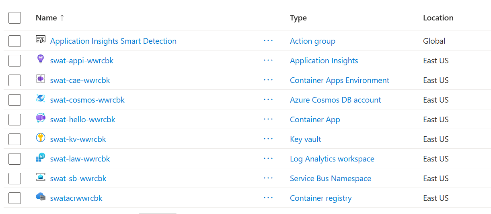

# Serverless Stack Smoke Test

A throwaway Terraform deployment that **proves the intended lab stack actually works** on
the vlabs subscription before we build labs on it. We learned the hard way that a service
being *allowed by policy* does not mean it has *quota* (App Service was allow-listed but had
0 compute quota), so this stands up one of each service the labs will use and confirms they
all deploy.

**Run this once now** (go/no-go for the stack), and again after any lab-environment change.

## What it deploys

All serverless / consumption / managed — **no dedicated-compute quota**, all in `eastus`:

| Service | Role in the labs |
|---------|------------------|
| Log Analytics + Application Insights | Observability (Session 17) |
| Container Registry (admin creds) | Stores your app image |
| Container Apps environment + app | Hosts the app as a container, HTTP ingress, rollback |
| Cosmos DB (serverless) | Data store |
| Service Bus (Standard) + queue | Messaging / event-driven exception handling |
| Key Vault | Secrets / secure config (Session 16) |

The Container App runs a **public hello image** so this test needs no image build.

## Before you start

- In the vlabs panel, the lab shows **Start – Complete** (it resets every ~4 hours).
- `01-prereqs-check` passes — in particular the Azure CLI and Terraform are installed.
- **Downloaded the repository as a ZIP?** Before extracting it, right-click the ZIP →
  *Properties* → tick **Unblock** → *OK*. Otherwise Windows marks every extracted file as
  "from the internet" and may warn you each time you run one.

## Steps

### 1. Run the test

**Windows** — double-click **`run-test.cmd`**, or run `.\run-test.cmd` in a terminal in this
folder. It works even where your company blocks PowerShell scripts.

**macOS / Linux / WSL:**
```bash
chmod +x run-test.sh    # first time only
./run-test.sh
```

The script does every step in the right order, and stops with a clear message if one fails:

| # | Step | What it does |
|---|------|--------------|
| 1 | Tools | Checks `az` and `terraform` are installed |
| 2 | Network and certificates | Uses your company proxy if Windows has one. If your network inspects HTTPS, makes the Azure CLI trust what your machine already trusts. See [Behind a company proxy](#behind-a-company-proxy) |
| 3 | Sign-in | Signs you in to Azure if needed — and again if the lab was reset since you last signed in |
| 4 | Resource providers | Registers the eight Azure services the stack uses (skips any already registered) |
| 5 | Terraform | Sets aside state left over from an earlier lab session, runs `terraform init`, shows the plan and **asks you to type `yes`** |
| 6 | Check | Waits for the app and confirms it returns HTTP 200 |

Read the plan before you type `yes`: on a fresh run it says **Plan: 11 to add, 0 to change,
0 to destroy**. Container Apps and Cosmos DB take a few minutes.

### 2. Confirm

**a. The app responds** — the script checks this for you (step 6 above).

**b. The resource group has every service.** In the Azure portal, open the
`swat-stack-smoke-rg` resource group — it should contain all eight resources below (plus an
auto-created *Application Insights Smart Detection* action group):



| Resource (yours will have a different suffix) | Type |
|-----------------------------------------------|------|
| `swat-hello-…` | Container App |
| `swat-cae-…` | Container Apps Environment |
| `swatacr…` | Container registry |
| `swat-cosmos-…` | Azure Cosmos DB account |
| `swat-sb-…` | Service Bus Namespace |
| `swat-kv-…` | Key vault |
| `swat-law-…` | Log Analytics workspace |
| `swat-appi-…` | Application Insights |

A 200 **and** all eight resources present = **the whole stack is viable**. If any single
resource is missing or failed, that's the one to redesign around (note which, and the error).

### 3. Destroy (do this promptly)

**Windows:** double-click **`destroy-test.cmd`**. **macOS / Linux / WSL:** `./run-test.sh destroy`.
Type `yes` when Terraform lists what it will delete.

> Key Vault is soft-deleted on destroy (Azure requirement). The random suffix means the next
> run gets a fresh name, so this won't block re-runs.

---

## Behind a company proxy

If your company network inspects HTTPS traffic, the Azure CLI fails with:

```
[SSL: CERTIFICATE_VERIFY_FAILED] certificate verify failed: self-signed certificate in certificate chain
```

Step 2 fixes this for you by running [`../tools/fix-company-proxy`](../tools/README.md). It
teaches the Azure CLI (and Git and npm) to trust **exactly what your machine already trusts**:
user-level only, no admin rights, and nothing bypassed. [`tools/README.md`](../tools/README.md)
explains what it changes, why that is within company policy, how to undo it, and what to do if
it still fails.

**Do not** switch certificate checking off or go around the proxy (a hotspot or personal VPN) to
make the error go away. That breaks company policy.

## Troubleshooting

| Symptom | Cause / fix |
|---------|-------------|
| `Please run 'az login'` | You ran `az` commands before signing in. Use the script — it signs in first. |
| `CERTIFICATE_VERIFY_FAILED ... self-signed certificate` | A company proxy inspects HTTPS. The script fixes this — see [Behind a company proxy](#behind-a-company-proxy). |
| "fix-company-proxy … not found" | You downloaded only this folder. Download the whole repository — the labs share the `tools` folder. |
| "Signed in, but the lab subscription is not reachable" / `SubscriptionNotFound` | The lab was reset. Press **Start** in vlabs, wait for *Start – Complete*, run the script again. |
| `terraform init` cannot download providers | Your network blocks it. On Windows the script uses the Windows proxy settings; if it still fails, share the exact error with your facilitator. |
| `MissingSubscriptionRegistration` | A resource provider is not registered yet — run the script again; it registers them. |
| `RequestDisallowedByPolicy` | The lab policy blocked something — see `../lab-constraints.md`. |
| Windows warns before running `run-test.cmd` | The files came from a downloaded ZIP. Unblock the ZIP before extracting (see *Before you start*), or choose *Run* on the warning. |

## Doing it by hand

The script is a convenience, not magic — these are the same steps, in the same order, if you
want to see each one. **Sign in first**; every other command needs it.

```powershell
az login
"Microsoft.OperationalInsights","Microsoft.Insights","Microsoft.ContainerRegistry","Microsoft.App",
"Microsoft.DocumentDB","Microsoft.ServiceBus","Microsoft.KeyVault","Microsoft.Storage" |
  ForEach-Object { az provider register --namespace $_ --wait }
$env:ARM_SUBSCRIPTION_ID = az account show --query id -o tsv
terraform init
terraform apply                                  # type yes
Invoke-WebRequest (terraform output -raw app_url) -UseBasicParsing | Select-Object StatusCode
terraform destroy                                # when done - type yes
```

(bash: the same, with `export ARM_SUBSCRIPTION_ID=$(az account show --query id -o tsv)` and
`curl -I $(terraform output -raw app_url)`.)

---

## How a Docker image is deployed (for the real labs)

This smoke test uses a public image, but in the labs you deploy **your own** image. The flow:

**1. Build** — from a `Dockerfile`:
```bash
docker build -t myapp:v1 .
# ...or build server-side in ACR (no local Docker needed):
az acr build --registry <acr-name> --image myapp:v1 .
```

Behind a company proxy, prefer `az acr build`: the build runs in Azure, so steps inside your
`Dockerfile` (such as `npm install`) are not affected by the proxy.

**2. Push** to ACR (skip if you used `az acr build`, which already pushed):
```bash
az acr login --name <acr-name>
docker tag  myapp:v1 <acr-name>.azurecr.io/myapp:v1
docker push <acr-name>.azurecr.io/myapp:v1
```

**3. Run** on Container Apps, pulling from ACR:
```bash
az containerapp update -n <app> -g <rg> --image <acr-name>.azurecr.io/myapp:v1
```

**Registry auth on this subscription:** the normal pattern (Container App managed identity +
`AcrPull` role) needs `roleAssignments/write`, which **Contributor doesn't have** here. So the
labs use **ACR admin credentials** instead (`admin_enabled = true`, username/password wired
into the Container App's `registry` block). No role assignment needed — works with Contributor.

## Provider versions

Pinned in `.terraform.lock.hcl` (azurerm ~> 4.0, random ~> 3.6). Config passes
`terraform validate` with no warnings.
