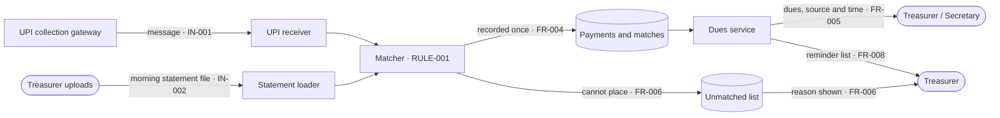
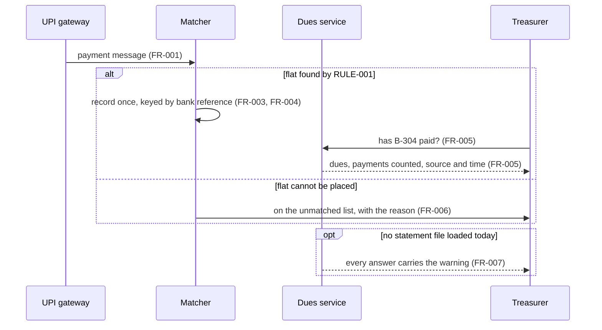

# Plan 001 — match payments, show dues

*Built from: `spec.md` as of Session 9 · Status: draft*

## 1. The approach in one paragraph

Two small receivers take payments in — one listens for UPI messages, one reads the morning file —
and both hand every payment to one matcher. The matcher applies RULE-001, records the payment exactly
as it arrived together with how it was matched, and uses the bank reference so the same payment is
never counted twice. Dues are worked out from what is recorded, so a dues answer can always say which
payments it counted and how old the newest one is. Anything the matcher cannot place goes to the
unmatched list.

## 2. Constitution check

| Rule | Passes? | If not — why, and who agreed |
|---|---|---|
| C-001 Nothing deleted | Yes — corrections are new records | |
| C-002 Only treasurer and secretary see payments | Yes — role checked on FR-005, FR-008 | |
| C-003 File at most once a day | Yes — FR-007 says when it is missing | |
| Q-001 Source and time on every answer | Yes — FR-005 | |
| Q-002 Never counted twice | Yes — bank reference is the key (ADR 0002) | |
| W-001 to W-006 | Yes | |

## 3. Pieces for this slice

| Piece | What it does | Requirement IDs | Talks to | Shape (call / message / file) | Decision record |
|---|---|---|---|---|---|
| UPI receiver | Takes each payment message in | FR-001 | Collection gateway | Message | `design/integration-decisions.md` seam 1 |
| Statement loader | Reads the morning file | FR-002, FR-007, NFR-002 | Treasurer's upload | File | seam 2 |
| Matcher | Applies the rule, records, de-duplicates | FR-003, FR-004, FR-006, RULE-001 | Payment store | — | ADR 0002 |
| Dues service | Answers dues and the reminder list | FR-005, FR-007, FR-008, NFR-001 | Committee members | Call | |

## 4. What it keeps

| Thing | What makes one unique | Kept for how long | Who owns the truth |
|---|---|---|---|
| Payment | Bank reference | Every year, for audit (C-001) | The bank statement |
| Match | Payment + flat + rule example used | Same as the payment | The matcher |
| Unmatched entry | Bank reference | Until the treasurer places it | The treasurer |

## 5. Interfaces

| Interface | Contract | Errors covered? | Duplicates handled by |
|---|---|---|---|
| UPI payment message | `specs/design/contracts/upi-payment.md` | Yes — malformed message goes to unmatched with reason | Bank reference |
| Statement file | `specs/design/contracts/bank-statement.md` | Yes — unreadable line reported, rest loaded | Bank reference |
| Dues answer | `specs/design/contracts/dues-query.md` | Yes — unknown flat, not allowed | — |

## 6. How each quality requirement is met, and measured

| NFR ID | How the design meets it | Metric | Where it is measured |
|---|---|---|---|
| NFR-001 | Dues worked out from a per-flat summary updated on every match *(inferred)* | 95th percentile response time | Load test with a month of payments |
| NFR-002 | Loader counts lines in, recorded and unmatched | In = recorded + unmatched | Check after every load, shown to the treasurer |

## 7. How we will test it

| Level | What it proves | One example from this slice |
|---|---|---|
| Rule examples | The rule gives the right answer | RULE-001a to RULE-001e |
| Contract | Each interface keeps its promise | Malformed UPI message is reported, not dropped |
| End to end | The slice works from input to the reminder list | Pay by UPI, load the file, flat not on the list, counted once |
| Failure path | A person sees what went wrong | No file today — warning on every answer |

## 8. Architecture and stack — from ADR 0003

Decided by the group in `specs/design/adr/0003-architecture-and-stack.md`. Copied here, not
re-decided. A change of stack is a new ADR first, then this section.

| Layer | Choice | What this slice needs from it | Because |
|---|---|---|---|
| Architecture | One deployable, separate modules | Receivers, matcher and dues service from section 3 as modules, not services | Q-002, Team |
| Language | Python | — | Team |
| Framework | FastAPI | Receive the UPI message and answer the dues call over HTTP, with a role check | FR-001, FR-005, C-002 |
| Data store | PostgreSQL | Insert-only tables; a unique key on the bank reference; the load count in one transaction | C-001, FR-004, NFR-002 |
| Test runner | pytest | The five RULE-001 examples as one table test | RULE-001 |
| Runs on | One container | A load test while a file is loading *(inferred from the ADR's consequences)* | NFR-001 |

## 9. Risks, and what we try first

| Risk | The smallest thing that would tell us early |
|---|---|
| Remarks are messier than the five examples | Run the matcher over last month's real remarks — count the unmatched |
| The gateway and the bank disagree on the reference | Compare one day's UPI messages with the same day's file |

## 10. Open questions

| # | Question | Who can answer |
|---|---|---|
| 1 | Part payments on the reminder list — see spec question 1 | Treasurer |

## 11. Diagrams — as code

### The area map — this slice and everything it talks to

### The main path — and what happens when it goes wrong

