# Plan <NNN> — <slice name>

*Built from: `spec.md` as of <date> · Status: draft*

> **How.** This file may name technology — but the stack is not decided yet.
> Where the stack matters, say what the plan **needs** from it (section 8), not which one.
> Anything the assistant inferred rather than took from our files is marked *(inferred)*.

## 1. The approach in one paragraph

<How the slice works end to end, in plain words.>

## 2. Constitution check

Every rule in `constitution.md` either passes, or is broken on purpose with a reason and a name.

| Rule | Passes? | If not — why, and who agreed |
|---|---|---|
| | | |

## 3. Pieces for this slice

| Piece | What it does | Requirement IDs | Talks to | Shape (call / message / file) | Decision record |
|---|---|---|---|---|---|
| | | | | | |

## 4. What it keeps

| Thing | What makes one unique | Kept for how long | Who owns the truth |
|---|---|---|---|
| | | | |

## 5. Interfaces

| Interface | Contract | Errors covered? | Duplicates handled by |
|---|---|---|---|
| | `specs/design/contracts/<file>.md` | | |

## 6. How each quality requirement is met, and measured

| NFR ID | How the design meets it | Metric | Where it is measured |
|---|---|---|---|
| | | | |

## 7. How we will test it

| Level | What it proves | One example from this slice |
|---|---|---|
| Rule examples | The rule gives the right answer | RULE-001 |
| Contract | Each interface keeps its promise | |
| End to end | The slice works from input to downstream effect | |
| Failure path | A person sees what went wrong | |

## 8. Stack — open decision

**Not decided in this file.** List what any stack must give this slice.

| Needed from the stack | Because |
|---|---|
| | FR-… / NFR-… |

## 9. Risks, and what we try first

| Risk | The smallest thing that would tell us early |
|---|---|
| | |

## 10. Open questions

| # | Question | Who can answer |
|---|---|---|
| | | |

## 11. Diagrams — as code

Two pictures, written in Mermaid so they live beside the plan, render in GitLab, change in the
same commit as the plan, and can be read by people and assistants alike. Label every line with the
requirement ID it serves. Your Session 6 photo stays in `specs/design/diagrams/` as the record of
how you got here — this is the version you keep up to date.

### The area map — this slice and everything it talks to

```mermaid
flowchart LR
  person([<role>]) -->|"<what passes> · FR-0xx"| slice[<this slice>]
  src1[<input 1>] -->|"message · IN-001"| slice
  src2[<input 2>] -->|"file · IN-002"| slice
  slice -->|"<what> · FR-0xx"| next[<who or what is told>]
```

### The main path — and what happens when it goes wrong

```mermaid
sequenceDiagram
  participant A as <input>
  participant S as <this slice>
  participant P as <person or downstream>
  A->>S: <what arrives> (FR-0xx)
  alt the rule can decide
    S->>P: <what they get> (FR-0xx)
  else it cannot
    S->>P: <what the person sees> (FR-0xx)
  end
```

