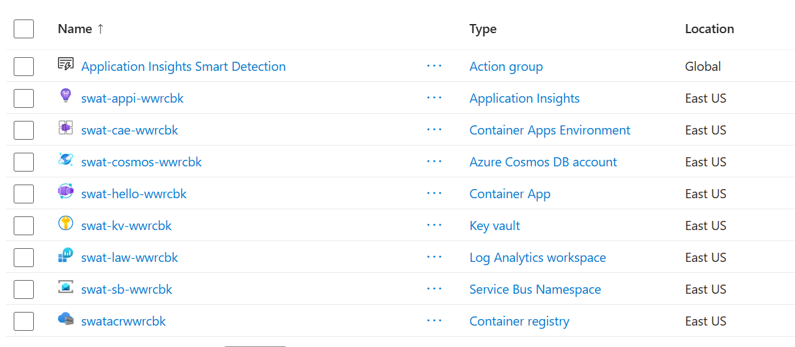

# Serverless Stack Smoke Test

A throwaway Terraform deployment that **proves the intended lab stack actually works** on
the vlabs subscription before we build labs on it. We learned the hard way that a service
being *allowed by policy* does not mean it has *quota* (App Service was allow-listed but had
0 compute quota), so this stands up one of each service the labs will use and confirms they
all deploy.

**Run this once now** (go/no-go for the stack), and again after any lab-environment change.

## What it deploys

All serverless / consumption / managed — **no dedicated-compute quota**, all in `eastus`:

| Service | Role in the labs |
|---------|------------------|
| Log Analytics + Application Insights | Observability (Session 17) |
| Container Registry (admin creds) | Stores your app image |
| Container Apps environment + app | Hosts the app as a container, HTTP ingress, rollback |
| Cosmos DB (serverless) | Data store |
| Service Bus (Standard) + queue | Messaging / event-driven exception handling |
| Key Vault | Secrets / secure config (Session 16) |

The Container App runs a **public hello image** so this test needs no image build.

## Prerequisites

- `az login` done and the lab subscription active (run `00-access-check` first).
- Terraform installed (`prereqs-check`).

## Steps

### 0. Register the resource providers (once per lab session)

```bash
for rp in Microsoft.OperationalInsights Microsoft.Insights Microsoft.ContainerRegistry \
          Microsoft.App Microsoft.DocumentDB Microsoft.ServiceBus Microsoft.KeyVault Microsoft.Storage; do
  az provider register --namespace "$rp" --wait
done
```

PowerShell:
```powershell
"Microsoft.OperationalInsights","Microsoft.Insights","Microsoft.ContainerRegistry",
"Microsoft.App","Microsoft.DocumentDB","Microsoft.ServiceBus","Microsoft.KeyVault","Microsoft.Storage" |
  ForEach-Object { az provider register --namespace $_ --wait }
```

### 1. Point Terraform at your subscription

```powershell
$env:ARM_SUBSCRIPTION_ID = az account show --query id -o tsv
```
(bash: `export ARM_SUBSCRIPTION_ID=$(az account show --query id -o tsv)`)

### 2. Deploy

```bash
terraform init
terraform apply      # type yes
```

Container Apps + Cosmos can take a few minutes. When it finishes you'll see outputs
including `app_url` and `stack_ok`.

### 3. Confirm

**a. The app responds:**

```bash
curl -I $(terraform output -raw app_url)     # expect HTTP/... 200
```

**b. The resource group has every service.** In the Azure portal, open the
`swat-stack-smoke-rg` resource group — it should contain all eight resources below (plus an
auto-created *Application Insights Smart Detection* action group):



| Resource (yours will have a different suffix) | Type |
|-----------------------------------------------|------|
| `swat-hello-…` | Container App |
| `swat-cae-…` | Container Apps Environment |
| `swatacr…` | Container registry |
| `swat-cosmos-…` | Azure Cosmos DB account |
| `swat-sb-…` | Service Bus Namespace |
| `swat-kv-…` | Key vault |
| `swat-law-…` | Log Analytics workspace |
| `swat-appi-…` | Application Insights |

A 200 **and** all eight resources present = **the whole stack is viable**. If any single
resource is missing or failed, that's the one to redesign around (note which, and the error).

### 4. Destroy (do this promptly)

```bash
terraform destroy    # type yes
```

> Key Vault is soft-deleted on destroy (Azure requirement). The random suffix means the next
> run gets a fresh name, so this won't block re-runs.

---

## How a Docker image is deployed (for the real labs)

This smoke test uses a public image, but in the labs you deploy **your own** image. The flow:

**1. Build** — from a `Dockerfile`:
```bash
docker build -t myapp:v1 .
# ...or build server-side in ACR (no local Docker needed):
az acr build --registry <acr-name> --image myapp:v1 .
```

**2. Push** to ACR (skip if you used `az acr build`, which already pushed):
```bash
az acr login --name <acr-name>
docker tag  myapp:v1 <acr-name>.azurecr.io/myapp:v1
docker push <acr-name>.azurecr.io/myapp:v1
```

**3. Run** on Container Apps, pulling from ACR:
```bash
az containerapp update -n <app> -g <rg> --image <acr-name>.azurecr.io/myapp:v1
```

**Registry auth on this subscription:** the normal pattern (Container App managed identity +
`AcrPull` role) needs `roleAssignments/write`, which **Contributor doesn't have** here. So the
labs use **ACR admin credentials** instead (`admin_enabled = true`, username/password wired
into the Container App's `registry` block). No role assignment needed — works with Contributor.

## Provider versions

Pinned in `.terraform.lock.hcl` (azurerm ~> 4.0, random ~> 3.6). Config passes
`terraform validate` with no warnings.
